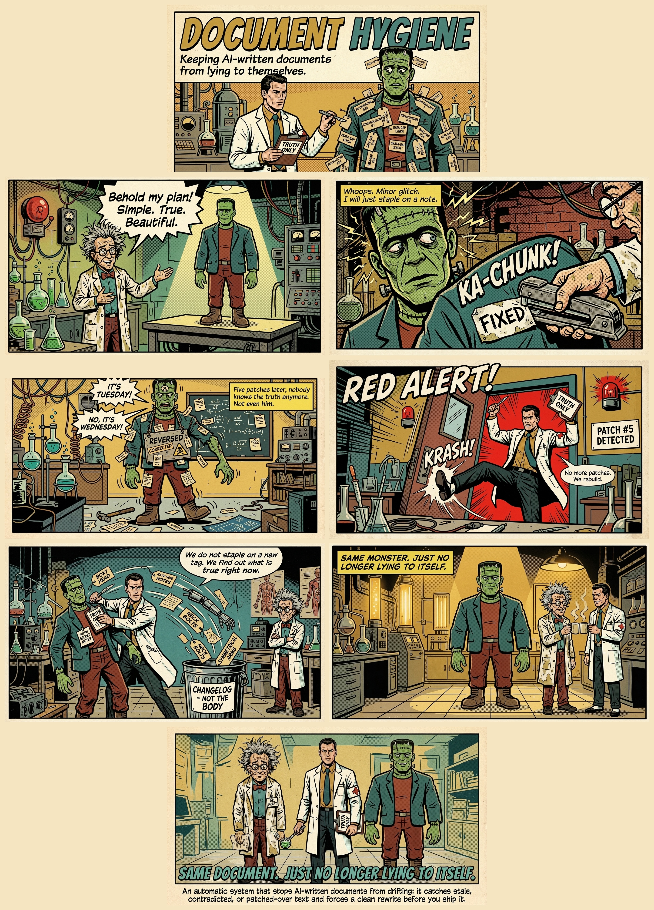

<!-- hygiene: ignore --><!-- this README documents the hygiene tool's own trigger vocabulary (corrected/reversed/TODO/etc.) as subject matter, not as drift in the doc itself -->

# Document Hygiene

A Claude Code skill + hook pair that stops long-lived AI-written documents from drifting: it catches stale claims, self-contradictions, and changelog scar tissue, and forces a clean rewrite before you ship the doc.

For anyone who runs a project with a goal, keeps a living document about it, and uses AI to iterate on execution: product managers, project managers, product owners, scrum masters, founders, vibe coders. If you have a launch plan, a spec, a status report, or a README that gets edited over and over by an AI agent, that document is drifting right now and this tool is for you.



Explainer video: [`docs/document-hygiene-promo.mp4`](docs/document-hygiene-promo.mp4)

## Why this exists

Short-lived docs don't drift: you write them once and move on. The ones that rot are the docs a project leans on for weeks: the spec, the plan, the architecture note, the README. Those get edited over and over.

When an AI agent edits a long doc, it does the economical thing: it rewrites the span the current task touches and leaves the rest alone. That's right for the immediate ask and wrong for the document: the model is patching the paragraph in front of it, not re-reading all 400 lines and reconciling them against reality. Do that fifty times and the doc becomes a sediment of half-updated truths.

### How the scars accumulate

Each project change lands as a *patch*, not a *rewrite*:

- **A decision reverses.** You switch Postgres → DynamoDB in week three. "Data model" gets updated; "Overview" still says Postgres. Two sections disagree, nobody flags it.
- **Something ships.** The plan still says *"Phase 3: blocked on the auth migration"* two weeks after that migration merged.
- **A thing gets renamed.** The install step calls `setup.sh`; the script is now `bootstrap.sh`. It wasn't wrong when written. The world moved.
- **The edits narrate themselves.** The doc accumulates its own diff: *"corrected the endpoint (was /v1, now /v2)"*, *"earlier draft said 4 workers, now 8"*, burying the current answer under the story of how it changed.

Each was a locally-correct edit. Drift is what you get when they're never reconciled globally, and AI makes them fast and in volume, so it builds far quicker than in a human-only doc.

### Why it's worth pruning

A drifted doc is worse than no doc, because people and agents still trust it:

- **It stops being usable.** One contradiction and the reader stops trusting the whole file, then re-verifies everything against the code: the work the doc was meant to save.
- **Agents inherit the lies.** The next AI session reads a stale *"we use Postgres"* as context and writes Postgres code. Wrong context in, wrong work out. Now the error is in the codebase.
- **Drift compounds.** New edits are made against a half-wrong picture, so the longer it's left, the more expensive the untangle, until the doc gets abandoned and rewritten from scratch.

Patching is not reconciling. This tool watches the sediment build up and forces a reconciliation pass: re-read the whole thing, re-verify every claim, fix both sides of each contradiction, strip the changelog scars, so the doc reads as one clean statement of what's true *now*.

## How it works

Three pieces, all Claude Code native (no external service):

1. **`hooks/track-doc-edits.sh`**: `PostToolUse` hook on `Edit|Write|MultiEdit`. Every time a `.md`/`.mdx` file is touched, it counts the edit and greps the file for scar markers (`corrected`, `reversed`, `TODO`, `⚠`, etc.). A file inside the project is always tracked, even if the project itself lives under `/tmp`; the temp/cache skip only applies to files outside the project. State is namespaced per Claude `session_id`, so concurrent agents/sessions never share counters or get blamed for each other's edits. Coverage is main-agent edits only: a subagent tool call (which carries its own `agent_id`) and a missing or malformed `session_id` are both skipped rather than tracked, since there's no shared bucket to misattribute them into.
2. **`hooks/check-doc-hygiene.sh`**: `Stop` hook. When a session ends, if it made 5+ doc edits or any touched doc shows scar markers, it injects a reminder into context naming exactly which docs to reconcile, and states the current mode (see below). Exits silently, with no reminder, when `stop_hook_active` is true (Claude is already continuing because of this same hook) or when every touched doc turned out to be exempt. Only ever *reminds*, never blocks, and only reports on docs the current session itself edited.
3. **`skills/document-hygiene/SKILL.md`**: the actual procedure Claude follows when the reminder fires (or when you ask "clean up this doc," "is this still accurate," etc.): a preflight (mode, exemptions, ownership scope, git recovery baseline), then re-read the whole doc fresh, re-verify every factual claim against current evidence, reconcile contradictions, strip changelog narration, resolve stale TODOs, check structural integrity, then a deterministic `grep` scar-scan (a review list, not an auto-delete list) before reporting.

### Modes: propose vs. apply

- **propose** (default): Claude re-reads and re-verifies as usual but doesn't edit the doc. It presents a compact list of proposed changes (current text, proposed text, evidence) and waits for you to accept.
- **apply**: Claude edits directly, but only for a doc that is committed and clean in git (tracked, not a symlink, no staged or unstaged changes); a doc that isn't gets proposed instead even though the session mode is apply. When nothing needs you, Claude replies with one line, `Hygiene pass: ok`; it writes more only for something that needs a human (a contradicted decision you already acted on, a decision only you can make, a setting to change) or something unusual in the pass.

Resolution order, first match wins: env var `DOCUMENT_HYGIENE_MODE` → `<project>/.claude/.hygiene/mode` → `~/.claude/document-hygiene/mode` → default `propose`. Parsing fails closed: once a source is picked (the env var is set, or a mode file exists), an empty or malformed value there resolves to `propose` directly rather than falling through to a lower-priority source.

### Recovery: git is the only undo

This tool stores no document content anywhere, not even temporarily: no backup, no versioning, nothing under `~/.claude` beyond edit counts and file paths. Recovery relies entirely on your own git history. Before editing a doc in apply mode, the Stop-hook reminder (and the skill, run manually) confirm the doc is committed and clean, then name the exact command that undoes the edit:
```
restore: git -C <repo-root> restore --source=<commit-sha> --worktree -- <path-relative-to-repo>
```
A doc that isn't committed and clean is reported as `<doc>: not committed and clean, propose only` instead: it's edited only after you review and accept the change by hand.

Switch it:
```bash
# Project-level (this repo/folder only)
mkdir -p .claude/.hygiene && echo apply > .claude/.hygiene/mode

# Global (every project)
mkdir -p ~/.claude/document-hygiene && echo apply > ~/.claude/document-hygiene/mode

# One-off (this command only)
DOCUMENT_HYGIENE_MODE=apply claude ...
```
Pick `apply` for solo work, where reviewing every proposal is pure overhead. Keep `propose` (the default) in a multi-agent folder or shared doc, where an unreviewed automatic edit is more disruptive than a short approval step.

### Justified markers

A `TODO`/`FIXME`/`XXX`/`HACK` written with an inline reason in parentheses, e.g. `TODO(keep until v2 ships)`, is treated as a deliberately kept marker, not a scar, and neither hook flags it. A bare `TODO` with no reason still counts as a scar candidate.

### Multi-agent / shared-folder safety

- **Opt-out**: a doc can exempt itself with an inline `<!-- hygiene: ignore -->` marker in its first 25 lines (also accepts `skip`, `collaborative`, `shared`, `audit`, `log`), or via glob patterns in `.claude/.hygiene/ignore` (one per line). The glob syntax is a subset of gitignore: shell globs matched against the basename, the project-relative path, and the absolute path; a pattern ending in `/` is a directory prefix (matches anything under it, e.g. `docs/audit/` or `docs/audit/*`); no negation, no `**`. Use this for audit logs, fact-check docs, or specs where words like "corrected" are the subject matter, not drift.
- **Attribution**: runtime state is namespaced per Claude `session_id`, so in a folder touched by multiple agents (or Claude + Codex), a reminder only ever lists docs *that session* edited. Coverage is main-agent edits only: a subagent tool call's `agent_id` is detected and skipped rather than credited to the parent session. State lives outside the repo: under `~/.claude/document-hygiene/state/<project-hash>/sessions/<session_id>/`, keyed by a hash of the project directory, so ordinary markdown edits never create untracked bookkeeping files inside your project. The only project-local file is the optional user-authored `.claude/.hygiene/ignore` config, which is safe to commit.
- **Hardening**: `session_id` is used to build a directory path that the Stop hook deletes with `rm -rf`, so both hooks sanitize it against a strict allowlist (rejecting path separators and `..`), and the Stop hook additionally refuses to delete anything outside its own `sessions/` root. A missing or malformed `session_id` is not tracked at all: there's no shared fallback bucket that could misattribute an edit or a reminder across sessions.
- **Authorship stamp convention** (optional, recommended for shared docs): when substantially editing a doc other agents may also touch, prepend an HTML-comment authorship block at the top of the file, e.g.:
  ```
  <!-- authors (newest first):
  - Claude Opus 4.8 · effort high · 2026-07-02 · drafted sections 1-4
  -->
  ```
  The tracker strips this block before scanning for scars, so it's safe to leave in place: it won't trigger false-positive drift warnings.

## Install

1. Copy the skill:
   ```
   cp -r skills/document-hygiene ~/.claude/skills/document-hygiene
   ```
2. Copy the hooks:
   ```
   cp hooks/track-doc-edits.sh hooks/check-doc-hygiene.sh ~/.claude/hooks/
   chmod +x ~/.claude/hooks/track-doc-edits.sh ~/.claude/hooks/check-doc-hygiene.sh
   ```
3. Wire the hooks into `~/.claude/settings.json`: merge this into your existing `hooks` block (don't overwrite the file, just add/merge these two entries):
   ```json
   {
     "hooks": {
       "PostToolUse": [
         {
           "matcher": "Edit|Write|MultiEdit",
           "hooks": [{ "type": "command", "command": "bash \"/Users/<you>/.claude/hooks/track-doc-edits.sh\"" }]
         }
       ],
       "Stop": [
         {
           "hooks": [{ "type": "command", "command": "bash \"/Users/<you>/.claude/hooks/check-doc-hygiene.sh\"" }]
         }
       ]
     }
   }
   ```
   Replace `/Users/<you>` with your actual home path. If you already have `PostToolUse`/`Stop` entries, add these as additional array items rather than replacing what's there.
4. Restart Claude Code (or start a new session) so the hooks load.

## Usage

Nothing to invoke manually most of the time: the `Stop` hook reminds you automatically once a session has made 5+ edits to a long-form doc, or as soon as a scar marker shows up in one. You can also trigger the skill directly any time: ask Claude "clean up this doc" or "is this still accurate," or after you notice you just reversed/corrected a claim (drift clusters: the same stale claim is usually echoed elsewhere).

## Requirements

- Claude Code with hooks support.
- `jq` and `bash` (both hook scripts depend on `jq` for parsing the hook JSON payload).
- `shasum` or `sha1sum` (used to key runtime state by project directory; `shasum` ships with macOS, `sha1sum` with most Linux distros). If neither is present the hooks fall back to a single shared state bucket.

## Tests

`tests/run.sh` is a self-contained regression suite for both hooks (it runs against a throwaway `HOME`, never your real state). Run it with `bash tests/run.sh`; it prints PASS/FAIL per case and exits non-zero on any failure.
