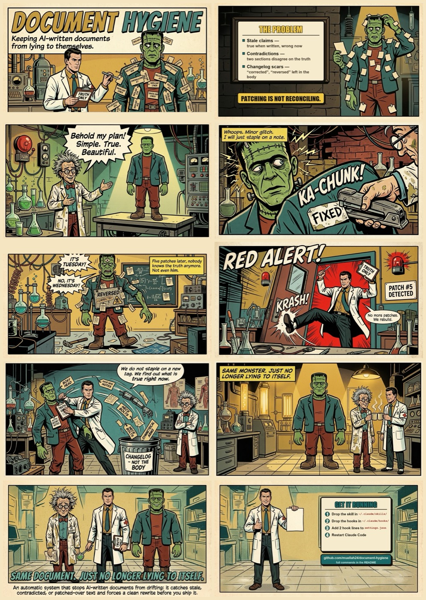

<!-- hygiene: ignore --><!-- this README documents the hygiene tool's own trigger vocabulary (corrected/reversed/TODO/etc.) as subject matter, not as drift in the doc itself -->

# Document Hygiene

An AI agent editing a long document patches only the paragraph in front of it, so after weeks the plan, spec, or README it maintains contradicts itself and nobody notices. Document Hygiene is a Claude Code skill and hook pair that makes Claude re-read, re-verify, and reconcile the whole document when a session has edited it heavily. It proposes fixes by default (you approve them) and can be switched to apply them directly, with your git history as the only undo. It never blocks a session, stores no document content, and runs no external service. It's for anyone who runs a project with a goal and keeps a living document about it: product managers, project managers, product owners, scrum masters, founders, vibe coders, and engineers alike.



[Full resolution](docs/document-hygiene-comic-FULL.jpg) · Explainer video: [`docs/document-hygiene-promo.mp4`](docs/document-hygiene-promo.mp4)

## What you get

- **A reminder at the end of a turn**: the Stop hook checks, when a turn finishes, whether the session has made 5+ edits to a Markdown doc or left a scar marker (`corrected`, bare `TODO`, etc.) in one of them (docs that opted out don't count). Detection is not real time: nothing happens mid-turn, only at the end, when the Stop event fires.
- **A disciplined reconciliation procedure**: on that reminder, Claude re-reads the whole document, re-verifies every claim against current evidence, fixes contradictions on both sides, and strips changelog narration.
- **Safe defaults**: nothing is edited without your say-so unless you deliberately switch modes, and even then, only inside a git safety net.

### Safety, in six lines

- Never blocks a session: it only reminds.
- Stores no document content anywhere, only edit counts and file paths, under `~/.claude`.
- Proposes changes by default; you approve them.
- Apply mode edits only a doc that is saved in git with no pending changes (committed and clean), and prints the exact `git restore` command before touching it.
- Any doc can opt out with a one-line marker.
- Covered by a regression suite (see Tests).

## Why documents drift

Short-lived docs don't drift: you write them once and move on. The ones that rot are the docs a project leans on for weeks: the spec, the plan, the architecture note, the README, edited over and over.

When an AI agent edits a long doc, it does the economical thing: it rewrites the span the current task touches and leaves the rest alone. That's right for the immediate ask and wrong for the document: fifty patches later, the doc is a sediment of half-updated truths.

Each project change lands as a *patch*, not a *rewrite*:

- **A decision reverses.** You switch Postgres to DynamoDB in week three. "Data model" gets updated; "Overview" still says Postgres.
- **A person leaves.** The launch plan still says Priya owns onboarding; Priya left in May.
- **A thing gets renamed.** The install step calls `setup.sh`; the script is now `bootstrap.sh`. It wasn't wrong when written. The world moved.
- **The edits narrate themselves.** The doc accumulates its own diff: "corrected the endpoint (was /v1, now /v2)", burying the current answer under the story of how it changed.

A drifted doc is worse than no doc, because people and agents still trust it: one contradiction and the reader re-verifies everything by hand anyway, the next AI session inherits a stale claim and builds on it, and the longer it's left the more expensive the untangle.

Patching is not reconciling. This tool watches the sediment build up and prompts a reconciliation pass: re-read the whole thing, re-verify every claim, fix both sides of each contradiction, strip the changelog scars.

## How it works

Three pieces, all Claude Code native (no external service):

1. **`hooks/track-doc-edits.sh`** (`PostToolUse` on `Edit|Write|MultiEdit`): counts edits to touched `.md`/`.mdx`/`.markdown` files and flags scar markers in them, namespaced per Claude session so concurrent agents never share counters or get blamed for each other's edits.
2. **`hooks/check-doc-hygiene.sh`** (`Stop` hook): when a session ends, if it made 5+ doc edits or hit a scar marker and at least one non-exempt doc remains in scope, injects a reminder naming exactly which docs to reconcile and the current mode.
3. **`skills/document-hygiene/SKILL.md`**: the procedure Claude follows on that reminder, or on request ("clean up this doc", "is this still accurate"): re-read the whole doc, re-verify every claim, reconcile contradictions, strip changelog narration, resolve stale TODOs, check structural integrity, then a deterministic scar scan before reporting.

These three are for a document that's a file. A project doc that lives inside Linear, Jira, or another tracker instead has no PostToolUse/Stop hook to trigger from (there's no file edit to catch) and uses a separate, opt-in, propose-only path: see [Living docs inside Linear, Jira and other trackers](#living-docs-inside-linear-jira-and-other-trackers) below.

### What a reminder looks like

Example: apply mode, one doc edited 6 times this session with a leftover bare `TODO`, in a repo at `/Users/you/project`. The Stop hook injects this as additional context (wrapped below for readability; only the line break before `restore:` is a real one, from the hook's own output):

```
Document-hygiene check due: 6 doc edit(s) since the last pass (this session
only). Drift/changelog markers found in:
/Users/you/project/docs/launch-plan.md. Touched docs:
/Users/you/project/docs/launch-plan.md. These are only docs YOU edited this
session. Skip any doc you did not author this session or that carries a
'hygiene: ignore' marker (another agent may own it). Otherwise run the
document-hygiene skill on the rest: fact-check every claim against current
evidence, delete stale/contradicted statements and changelog narration, so
each doc reads as a clean current version. Mode: apply (edit directly; when
nothing needs a human, reply with the single line 'Hygiene pass: ok' and
nothing more).
restore: git -C /Users/you/project restore --source=1a2b3c4d5e6f7089abcdef1234567890fedcba98 --worktree -- docs/launch-plan.md
```

Note the two path styles: `Touched docs` and `Drift/changelog markers found in` show the file path as Claude's tools recorded it (absolute); the restore command's target, after `--`, is repo-relative, because `git restore` expects a path relative to the repo root it's run against.

## Modes

- **propose** (default): Claude re-reads and re-verifies as usual but doesn't edit the doc. It presents a compact list of proposed changes (current text, proposed text, evidence) and waits for you to accept.
- **apply**: Claude edits directly, but only a doc that's committed and clean in git; anything else gets proposed instead even though the session mode is apply. When nothing needs you, Claude replies with one line, `Hygiene pass: ok`.

Resolution order, first match wins: env var `DOCUMENT_HYGIENE_MODE` → `<project>/.claude/.hygiene/mode` → `~/.claude/document-hygiene/mode` → default `propose`. Parsing fails closed: once a source is picked (the env var is set, or a mode file exists), an empty or malformed value there resolves to `propose` directly, rather than falling through to a lower-priority source.

Switch it:
```bash
# Project-level (this repo/folder only)
mkdir -p .claude/.hygiene && echo apply > .claude/.hygiene/mode

# Global (every project)
mkdir -p ~/.claude/document-hygiene && echo apply > ~/.claude/document-hygiene/mode

# One-off (this command only)
DOCUMENT_HYGIENE_MODE=apply claude ...
```
Pick `apply` for solo work, where reviewing every proposal is pure overhead. Keep `propose` (the default) in a multi-agent folder or shared doc, where an unreviewed automatic edit is more disruptive than a short approval step.

### Recovery: git is the only undo

This tool stores no document content anywhere, not even temporarily: no backup, no versioning, nothing under `~/.claude` beyond edit counts and file paths. Recovery relies entirely on your own git history.

"Git" here means the local save-history inside your project folder (the hidden `.git` directory), not GitHub. Every commit is a snapshot kept on your own disk, and the undo below reads from that snapshot. GitHub is not involved: nothing is pushed, fetched, or read from any server. Before editing a doc in apply mode, the Stop-hook reminder (and the skill, run manually) confirm the doc is committed and clean and record the exact command that undoes the edit, shell-quoted so it can be pasted and run as-is even when the repo path or file name contains spaces:
```
restore: git -C <repo-root> restore --source=<commit-sha> --worktree -- <path-relative-to-repo>
```
You see only a three-word confirmation before the edit, `Undo ready (git).`; Claude prints the full command if the pass goes wrong or if you ask how to undo.
A doc that isn't safe to auto-edit is named with the specific reason instead, and handled in propose mode (reviewed and accepted by hand) even though the session mode is apply:
- `<doc>: not in a git repository, propose only` (the folder itself isn't a git repo). Apply mode is unavailable here until you enable it: a one-time `git init`, adding the docs, and a commit is all it takes, and you can ask Claude to do that for you (Claude will ask before running `git init`, since creating a `.git` directory in a folder you didn't ask about, like a Dropbox or Drive folder, is a visible change). The reminder adds this same one-line offer, once, whenever this reason applies to any doc.
- `<doc>: never committed, propose only` (the folder is a git repo, but this doc was never added and committed).
- `<doc>: has uncommitted changes, propose only` (the doc has staged or unstaged changes waiting).
- `<doc>: is a symlink, propose only` (the tool won't blind-edit through a symlink).
- `<doc>: git not installed, propose only` (no `git` on the PATH at all).

## Install

Both hook scripts are short, plain bash (each under 250 lines); read them before wiring them in.

1. Create the target directories (harmless if they already exist), then copy the skill:
   ```bash
   mkdir -p ~/.claude/skills ~/.claude/hooks
   cp -r skills/document-hygiene ~/.claude/skills/document-hygiene
   ```
2. Copy the hooks, and `bin/check-staleness` if you'll use the Linear/Jira/other-tracker path (see [Living docs inside Linear, Jira and other trackers](#living-docs-inside-linear-jira-and-other-trackers)):
   ```bash
   cp hooks/track-doc-edits.sh hooks/check-doc-hygiene.sh ~/.claude/hooks/
   chmod +x ~/.claude/hooks/track-doc-edits.sh ~/.claude/hooks/check-doc-hygiene.sh
   mkdir -p ~/.claude/bin
   cp bin/check-staleness ~/.claude/bin/check-staleness
   chmod +x ~/.claude/bin/check-staleness
   ```
   `bin/check-staleness` has no hook to wire: nothing in `settings.json` calls it. The skill invokes it by path when a PM-doc check runs (manually, or from whatever schedule you set up per the reference for your tool); copying it next to the hooks just keeps everything the skill needs in one place.
3. Wire the hooks in. Pick a scope, project first:

   **Project only (recommended to start)**: add this to `<project>/.claude/settings.json` (create the file if it doesn't exist), so the hooks run only in that project:
   ```json
   {
     "hooks": {
       "PostToolUse": [
         {
           "matcher": "Edit|Write|MultiEdit",
           "hooks": [{ "type": "command", "command": "bash \"/Users/<you>/.claude/hooks/track-doc-edits.sh\"" }]
         }
       ],
       "Stop": [
         {
           "hooks": [{ "type": "command", "command": "bash \"/Users/<you>/.claude/hooks/check-doc-hygiene.sh\"" }]
         }
       ]
     }
   }
   ```

   **Every project**: add the same block to `~/.claude/settings.json` instead. The tracker then runs briefly on every Edit/Write in every project, exiting immediately for non-Markdown files.

   Replace `/Users/<you>` with your home directory (`/Users/<name>` on macOS, `/home/<name>` on Linux). If the settings file already has `PostToolUse`/`Stop` entries, add these as additional array items rather than replacing what's there.

   If you would rather not hand-edit JSON, paste the block into Claude Code and ask it to merge these two hook entries into the settings file for you.
4. Restart Claude Code (or start a new session) so the hooks load.

## Verify the install

1. From the cloned repo, run `bash tests/run.sh`: it confirms both hooks run correctly on this machine (a throwaway `HOME`, touches nothing real).
2. Start a new Claude Code session and run `/hooks`: `PostToolUse` and `Stop` should each show at least one configured hook.
3. End to end: ask Claude to create a scratch Markdown file containing a bare `TODO` line, then finish its turn. When it finishes, the Stop hook injects the reminder, and Claude should come back proposing to resolve or justify that `TODO` (in the default propose mode). Delete the scratch file afterward.

## Uninstall

1. Remove the two hook entries from wherever you added them (`~/.claude/settings.json` or `<project>/.claude/settings.json`).
2. Delete the two hook files, `bin/check-staleness` if you copied it, the skill folder, and the runtime state and mode files:
   ```bash
   rm ~/.claude/hooks/track-doc-edits.sh ~/.claude/hooks/check-doc-hygiene.sh
   rm -f ~/.claude/bin/check-staleness
   rm -rf ~/.claude/skills/document-hygiene ~/.claude/document-hygiene
   ```
   Also remove any scheduled task, webhook, or automation rule you set up for a PM-doc check (see [Living docs inside Linear, Jira and other trackers](#living-docs-inside-linear-jira-and-other-trackers)): those live in whichever host you wired them into, not under `~/.claude`, so this tool can't remove them for you.

Nothing else was written anywhere, except any `.claude/.hygiene/` mode or ignore files you created yourself inside a project; remove those by hand if you want them gone.

## Configuration

- **Opt out a doc**: add `<!-- hygiene: ignore -->` (also accepts `skip`, `collaborative`, `shared`, `audit`, `log`) in its first 25 lines.
- **Opt out a path pattern**: list globs in `.claude/.hygiene/ignore`, one per line. A subset of gitignore syntax: shell globs matched against the basename, the project-relative path, and the absolute path; a pattern ending in `/` is a directory prefix (matches anything under it, e.g. `docs/audit/` or `docs/audit/*`); no negation, no `**`.
- **Justified markers**: `TODO(<reason>)` (and `FIXME`/`XXX`/`HACK` the same way) is a deliberately kept marker, not a scar. A bare marker with no reason still counts as a scar candidate.
- **Authorship stamp** (optional, for shared docs): prepend an HTML-comment block when substantially editing a doc other agents may also touch, e.g.:
  ```
  <!-- authors (newest first):
  - Claude Opus 4.8 · effort high · 2026-07-02 · drafted sections 1-4
  -->
  ```
  The tracker strips this block before scanning for scars, so it's safe to leave in place.

## Multi-agent folders

- **Attribution is per session**: a reminder only ever lists docs *that session* edited, never a concurrent agent's work.
- **Main-agent edits only**: a subagent tool call carries its own `agent_id` and is skipped rather than credited to the parent session.
- **State lives outside the repo**: under `~/.claude/document-hygiene/state/`, keyed by project and session, so ordinary markdown edits never leave untracked bookkeeping files inside your project.
- **Hardened cleanup**: the session ID is sanitized against a strict allowlist before it's used to build the path the Stop hook deletes, and that deletion is fenced to its own state directory.

## Using it with other AI coding agents

The automatic reminder (the two hooks) is Claude Code specific today; the reconciliation procedure itself is not. [`INSTRUCTIONS.md`](INSTRUCTIONS.md) is the same procedure rewritten with no dependency on Claude-specific tool names or Claude Code's hook system, for use with any AI coding agent.

| Tool | Where to put `INSTRUCTIONS.md` (or its content) | Automatic hooks |
|---|---|---|
| Cursor | `.cursor/rules/` or a skill in `.cursor/skills/` (documented) | Has `afterFileEdit` and `stop` hooks (documented); adapter possible, not shipped |
| GitHub Copilot (VS Code agent mode) | `.github/copilot-instructions.md` (documented) | VS Code has PostToolUse/Stop hooks in `.github/hooks` (documented); adapter possible, not shipped |
| GitHub Copilot CLI | Same instructions file (documented) | postToolUse/agentStop hooks (documented); adapter possible |
| OpenAI Codex CLI | `AGENTS.md` or a skill in `.agents/skills/` (documented) | PostToolUse/Stop hooks (documented); adapter possible |
| Gemini CLI | `GEMINI.md` or `.gemini/skills/` (documented) | AfterTool/AfterAgent hooks (documented); adapter possible |
| Google Antigravity | Rules and skills (documented) | PostToolUse/Stop hooks (documented); adapter possible |
| Continue, Roo Code | Rules/skills only (documented) | No documented end-of-turn hook found; manual use only |

"Documented" means the mechanism appears in the vendor's own reference pages as of September 2026 ([VS Code hooks](https://code.visualstudio.com/docs/agents/reference/hooks-reference), [Copilot hooks](https://docs.github.com/en/copilot/reference/hooks-reference), [Cursor hooks](https://cursor.com/docs/hooks), [Gemini CLI hooks](https://geminicli.com/docs/hooks/reference/), [Antigravity hooks](https://antigravity.google/docs/hooks)); none of these ports has been built or tested end to end. Each tool's edit-event payload and end-of-turn contract differ from Claude Code's, so every port is a small adapter, not a copy.

Adapters are not part of this repo yet; the first one, if any, would be Cursor. Open an issue if you want one.

## Living docs inside Linear, Jira and other trackers

A project's "current state" doc can live inside a project-management tool instead of a file: a Linear project document, a Jira or Confluence page, a Notion database entry. Those drift the same way a Markdown file does, just against a different kind of evidence. A real (anonymized) example, found within 30 hours of the doc's own last edit: a Linear project document still listed one ticket as "planned" and another as "not started" after the first had shipped and the second had moved to in progress, and named none of five tickets created since the doc was last touched.

There's no file edit to hook here, so this path is separate from the three pieces above: opt-in, and checked manually or on a schedule, not automatically on every edit.

- **Opt-in marker**: a PM doc is checked only when it carries a `hygiene: watch` marker (a plain visible line of text in its first 25 lines, since most PM editors strip HTML comments, unlike the `hygiene: ignore` marker above) or on explicit request.
- **The trigger, `bin/check-staleness`** (bash and `jq`, no other dependency, no network call): four deterministic rules over the doc's own `updatedAt` and the linked issues' statuses and dates decide whether a pass is due.

  | Rule | Fires when |
  |---|---|
  | T1 (status mismatch) | An issue ID referenced in the doc text whose current status disagrees with the status wording on the same line as the ID. |
  | T1b (weaker: silent drift) | A referenced issue updated after the doc, now started or completed, with no status word at all on any line that mentions it. |
  | T2 (volume) | At least 5 (configurable) issues updated after the doc's own `updatedAt`. |
  | T3 (age) | The doc is older than 7 days (configurable) while the project is still active. |
  | T4 (unreferenced new work) | Issues created after the doc's `updatedAt` whose ID never appears in the doc text. |

- **Propose only, delivered as a comment**: there's no git undo for a Linear document or a Jira issue, so this path never edits the doc. The reconciliation runs in propose mode always, and the result goes out as a comment on the document or project, for a human to review and apply.
- **Scheduling is offered, never created unasked**: wiring the check to a clock or an event (a scheduled task, a webhook, an agent mention) is host-specific. The first manual run for a given project offers to set one up and waits for a yes.

Recipes for turning a specific tool's API into `bin/check-staleness`'s input: [`references/linear.md`](skills/document-hygiene/references/linear.md), [`references/jira.md`](skills/document-hygiene/references/jira.md), and [`references/generic.md`](skills/document-hygiene/references/generic.md) for any other tool. `bin/check-staleness` itself is covered by the same regression suite as the two hooks (see Tests, below).

## Limits

- Markdown only for the automatic hooks: `.md`, `.mdx`, `.markdown`. Other file formats aren't tracked. A living doc inside a PM tool isn't a file at all and uses the separate, opt-in path described above.
- The hooks only remind; the reconciliation itself depends on Claude following the skill correctly.
- Coverage is main-agent edits only: subagent tool calls aren't tracked.
- The recovery check needs git and a doc that's already committed and clean; anything else falls back to propose mode regardless of the session's mode setting. A folder that isn't a git repository at all works in propose mode with no setup: the reminder names that as the specific reason and offers to set git up for you (see Recovery above).
- Developed and tested on macOS and Linux shells (bash, jq); not on Windows.
- The tracker hook starts a short bash process (using jq) on every Edit, Write, or MultiEdit tool call; it exits immediately for anything that is not a Markdown file. Both hooks call `git rev-parse` to find the project root whenever `CLAUDE_PROJECT_DIR` is unset, in every mode (falling back harmlessly to the current directory if git is absent); the recovery-baseline git calls inside `recovery_line` are the only git calls limited to apply mode.

## Requirements

- macOS or Linux with bash 3.2 or newer. Native Windows is not supported (the hooks are bash scripts); WSL is untested.
- Claude Code with PostToolUse and Stop command hooks.
- `jq` on the PATH that hooks run with (not only in your interactive shell). Stock macOS does not ship it: `brew install jq`. If it is missing, the Stop hook tells you once and nothing is tracked until it is installed.
- Standard Unix tools: cat, cut, basename, dirname, head, grep, sed, sort, find, mkdir, rm. Present on macOS and any normal Linux; a minimal container image needs bash, jq, grep, sed and findutils installed.
- A writable `~/.claude/document-hygiene` directory (created on first use).
- Recommended: `shasum` or `sha1sum` (macOS has shasum, most Linux distros have sha1sum). Without either, all projects share one state directory, still separated per session.
- Optional: git 2.23 or newer, for the apply-mode recovery check and the `git restore` undo command. Without git every doc is handled in propose mode; project-root detection falls back to the current directory.
- Running the tests additionally needs awk, mktemp, ln, tr, wc; the YAML check uses Ruby or Python 3 with PyYAML if present, otherwise it is skipped.
- `bin/check-staleness` (the Linear/Jira/other-tracker path) needs only bash and `jq` 1.6 or newer built with regex support (Oniguruma; the default build for any jq 1.6+ package). No git, no network access, no other tool: it reads JSON on stdin and writes JSON to stdout. It checks its own jq version's regex support on startup and exits with a clear message instead of failing deep inside the filter if that's missing.

## Tests

`tests/run.sh` is a self-contained regression suite for both hooks and for `bin/check-staleness` (it runs against a throwaway `HOME`, never your real state). Run it with `bash tests/run.sh`; it prints PASS/FAIL per case and exits non-zero on any failure.

## License

MIT. See [LICENSE](LICENSE).
